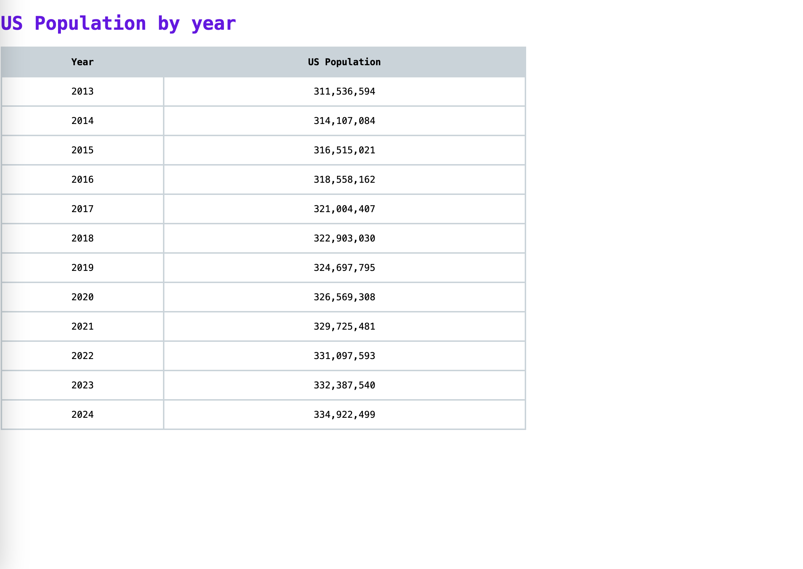

# spr cs3980 assignment 2

```bash
python3 -m venv venv
source ../.venv/bin/activate  or  . venv/bin/activate
pip3 install fastapi
pip3 install uvicorn
uvicorn main:app --reload
```
Basic page to display a table of the US Population by year.

Data is from https://api.datausa.io/tesseract/data.jsonrecords?cube=acs_yg_total_population_5&measures=Population&drilldowns=Year

Used FastAPI and fetch.


```bash
pip3 freeze > requirements.txt
```